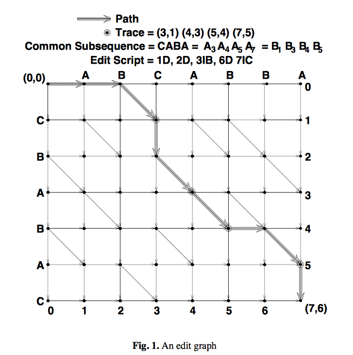
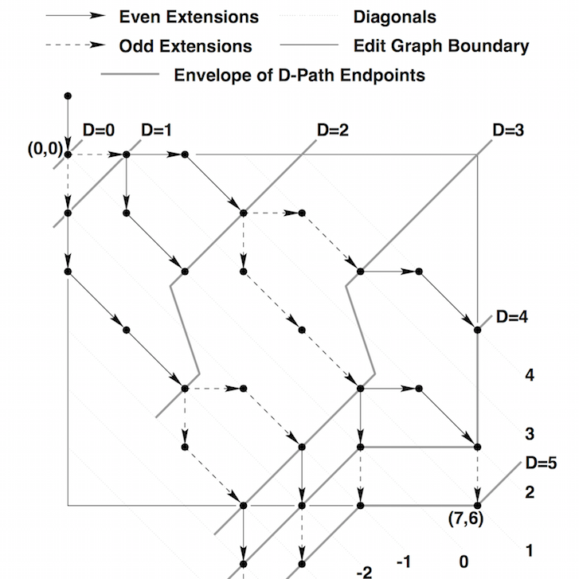

# Allegro list comparer

## Intro

This application provides ability to find Shortest Edit Script functionality using REST api. Code base is using scala version of [play framework](https://www.playframework.com/).

## Algorithm

Algorithm used in this app is a basic greedy diff algorithm, as described by Eugene W. Myers in his paper,  ["An O(ND) Difference Algorithm and Its Variations"](http://xmailserver.org/diff2.pdf). It was published in the journal "Algorithmica" in November 1986.

### Definitions

#### Shortest edit script

Myers proved that solving the problem of the Shortest Edit Script can be reduced to just finding the shortest path in the editor graph. There are 3 types of commands int this script: 

* change  
* removal 
* addition 

#### Editor graph

The editor graph is a graph where elements of first collection are on x-axis, elements of second collection are on y axis, as you see on picture below:

Every path from top left to right bottom to right down can be translated as an editor script transforming first collection to another in following way:

 - moving right removes an element from x axis
 - moving down adds an element to y axis
 - we can combine moving right and down into substitution of element
 - moving diagonal means that we don't need to change anything
 
#### d-path

D-path is a path with d right and left moves. Please note that diagonals move are not counted.

#### d-envelope

D-Envelope is a line which is drawn by all furthest d-path

### How it works?

Myers figured out several things in his work, that optimise algorithm:
1. algorithm is greedy - we are going to analyze firstly paths with 1-change allowed, then with 2-changes, etc. until the bottom right corner of graph will be reached.
2. lets enumerate diagonals - the 0 comes out from (0,0) below are enumerated them -1,-2,-3, above 1,2,3. In such case
 for path with k-changes we have only to analyse diagonals from (-k,+k). Moreover only every second diagonal needs to be analyzed (because extending
 path with a change than the end of path will be on diagonal with number 1 less (or more) than the original one.
 
 

Current implementation is a functional one - a bit different than imperative approach. We are using always previous d-envelope to generate next one, 
without need of manually manage number of diagonals and differences in for-loops. 

## Performance considerations

### Complexity

The algorithm itself works in O(ND) where N is sum of sizes of lists being compared and D is the number of modifications (both in terms of computation and memory). The path is transformed to editor script in linear time time.

### Performance tests

There are suite of performance tests created using [scala meter](https://scalameter.github.io). It provides nice option for regression test to be setup on CI if necessary. Benchmark tests can be run:
    
    ./activator benchmark:test

Results are stored by default in tmp/report/index.html - they can be attached to CI server and configure as regression test if it would be needed. For doing that follow instructions on [scala meter page](http://scalameter.github.io/home/gettingstarted/0.7/regressions/index.html)

## REST Api

Server provides simple API, the requests are json containing left and right collections. Collection items can be any legal json type.

#### Resource URL

POST /v1/compare

#### Resource Information
Response formats: JSON

Requires authentication? No

Rate limited? No

Additional response header: Request-Time

#### Parameters
left (required): valid json collection to compare
 
right (required): valid json collection to compare

     
#### Example Request
    curl \
      --header "Content-type: application/json" \
      --request POST \
      --data '{"left": ["a","l","l","e","g","r","o"], "right":["a","m","a","z","o","n"]}' \
      http://localhost:9000/v1/compare
     
#### Response
    {"changes":[
        "change":{"index":1,"original":"m","revision":"l"},
        "change":{"index":2,"original":"a","revision":"l"},
        "change":{"index":3,"original":"z","revision":"e"},
        "remove":{"index":4,"value":"g"},
        "remove":{"index":4,"value":"r"},
        "add":{"index":5,"value":"n"}
      ]
    } 
## Running server localy

just run
    ./activator run
    
    
## Functional tests

Functional test are using port 19001 - it can be changed by setting the system property testserver.port. To run test:

    ./activator fun:test

## Deployment

You can use the stage task to prepare your application to be run in place. The typical command for preparing a project to be run in place is:

    $ ./activator dist
  
Application is ziped to 
    
    /target/universal/comparerro-[version].zip

After deploying on the server following command needs to be run:

    $ bin/comparerro

Specifying the HTTP server address and port

You can provide both HTTP port and address. The default is to listen on port 9000 at the 0.0.0.0 address (all addresses).
    
    $ /path/to/bin/comparerro -Dhttp.port=1234 -Dhttp.address=127.0.0.1
    
Specifying additional JVM arguments

    $ /path/to/bin/comparerro -J-Xms128M -J-Xmx1g -J-server
    
As a convenience you can also set memory min, max, permgen and the reserved code cache size in one go; a formula is used to
determine these values given the supplied parameter (which represents maximum memory):
    
    $ /path/to/bin/<project-name> -mem 1024 -J-server
    
Additional configuration information you may find in [play documentation](https://www.playframework.com/documentation/2.3.x/ProductionConfiguration).
If deploying in could env is necessary please follow those instructions:

* [Deploying to Heroku](https://www.playframework.com/documentation/2.3.x/ProductionHeroku)
* [Deploying to Cloud Foundry](https://www.playframework.com/documentation/2.3.x/Deploying-CloudFoundry)
* [Deploying to Clever Cloud](https://www.playframework.com/documentation/2.3.x/Deploying-CleverCloud)

## Ideas for future

Depending on the env requirements and need for controlling scalability directly in this service it may be nice 
to introduce throttling of requests and requests limits (for example using akka). 